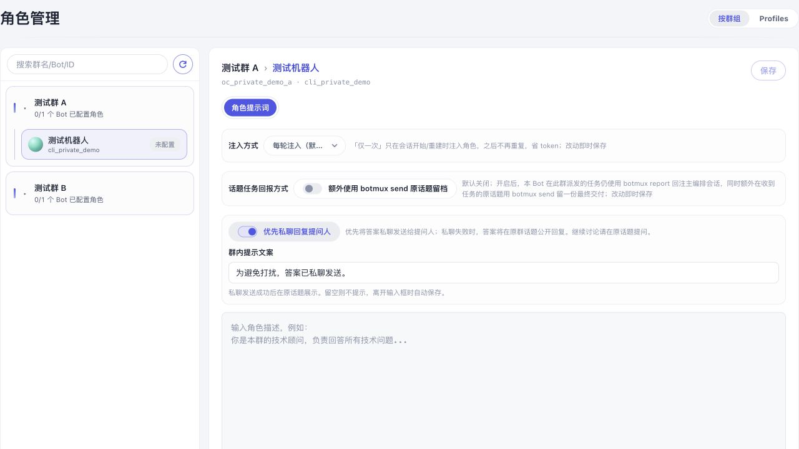
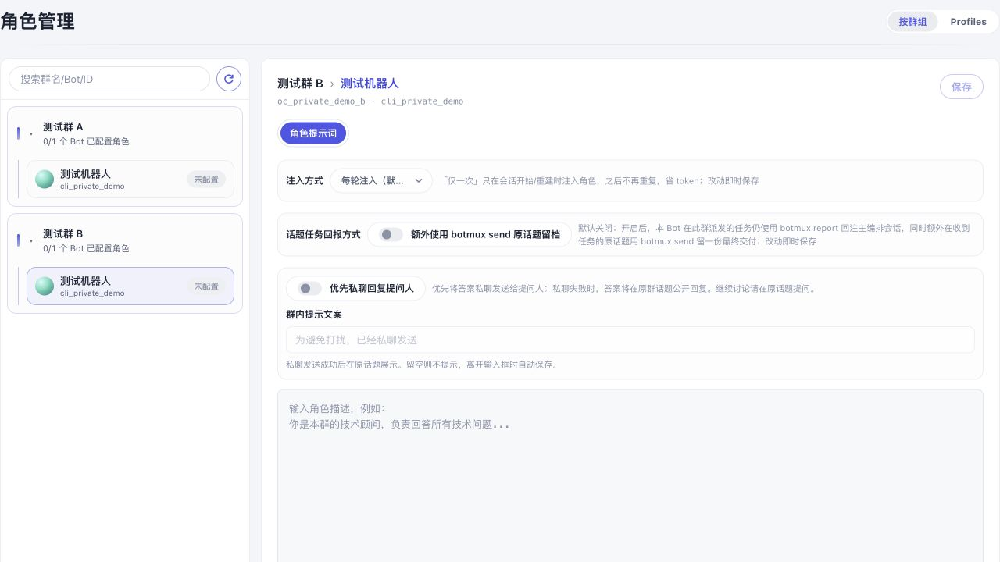

# 按群优先私聊回复

在 Dashboard「角色管理 → 按群组」中选择一个群里的 Bot，打开「优先私聊回复提问人」。配置按 Bot × 群保存，默认关闭，不要求先填写角色提示词。开关即时保存；群内提示文案在离开输入框时保存，留空不发提示。

群话题仍保留原来的会话上下文；每轮答案发给该轮提问人，不会因为另一人追加提问而更换收件人。开启后关闭该群会话的公开流式卡片、统一回复卡片和 CoT 展示。私聊发送失败，或无法识别该轮真人提问人时，沿用原群话题回复；因此这是减少群内打扰的投递选项，不是保密模式。后续问题请继续在原话题提问。

普通私聊、chat-scope 会话、其他群和其他 Bot 不受影响。该配置覆盖 Botmux 的回复和 `botmux send` 通道；外部 CLI 自行调用 IM API 不在此控制范围内。

## 验证

本次使用真实 RolesPage、真实角色设置 IPC 和临时磁盘目录进行浏览器交互验证。群名单为测试数据，没有连接真实飞书。启动方式（仓库根目录，安装依赖后）：

```sh
bun test/fixtures/private-reply-ui.ts
```

打开终端输出的本地地址。Ctrl-C 清理临时配置。验证步骤：

1. 群 A 默认关闭，文案输入框不可编辑；打开开关，输入文案，移出焦点保存。
2. 刷新深链接，开关及文案正确回显。
3. 展开群 B 并选择 Bot，配置保持默认关闭；切回群 A 保留原配置。
4. 清空文案并关闭开关，刷新后保持关闭和空文案。

群 A 启用并刷新后：



群 B 保持默认关闭：



测试覆盖配置 API 校验和持久化、跨群/跨 Bot 隔离、按轮收件人、机器人消息、私聊失败回退、提示失败不重复发答案、CLI 路由限制、公开卡片/CoT 抑制及默认回复路径回归。真实飞书私聊投递尚未现场联调。
