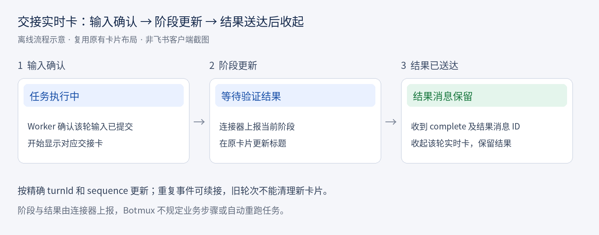

# 连接器交接实时卡

连接器可在 `/api/trigger` 请求中设置 `presentation.liveCard: "on-start"`，并通过 `presentation.title` 设置标题。仅飞书群内的 chat 会话支持该展示；省略选项时沿用现有行为。

`presentation.thinking: "hidden"` 可独立隐藏本次精确轮次的思考过程；它不隐藏最终结果、错误或 HTTP 回执，也不隐式启用实时卡。两项可以组合使用。普通、等待和异步派发均保留原 shared 话题锚点；等待/异步返回不会因为展示设置而被静默。

卡片在对应 `turnId` 的输入被 Worker 确认提交后开始更新，不把 HTTP 接收成功或其他群消息当作执行开始。私密卡、静默轮次及禁用实时卡仍服从原有展示设置。

## 阶段与完成事件

使用现有 Dashboard 写入鉴权，向 `POST /api/sessions/:sessionId/live-stage` 发送 JSON。请求由 Dashboard 路由至拥有该会话的 daemon，只读访问不能写入。

阶段事件示例：

```json
{"turnId":"trg_example","sequence":1,"kind":"stage","title":"等待验证结果"}
```

连接器在**确认结果消息已成功送达原目标**后，才发送完成事件：

```json
{"turnId":"trg_example","sequence":2,"kind":"complete","resultMessageId":"om_example"}
```

`resultMessageId` 是连接器声明的送达证据，Botmux 校验格式但不查询消息内容。阶段名称与业务顺序由调用方定义；接口不要求经过需求、开发或测试等固定步骤，也不自动派发业务任务。

## 重试与恢复

- `sequence` 是同一轮次内递增的正整数。旧事件不回退阶段；同序号、同内容的重试保持幂等，同序号不同内容返回冲突。
- `complete` 先持久化关闭状态，再撤回对应实时卡；结果消息保留。`live_stage_recall_failed` 表示撤回失败，可重试同一完成事件，无需重跑业务。
- 首次完成会固定被关闭卡片的 ID 与 nonce，并记录成功撤回。重复完成只处理原卡片。完成后用户手动 `/card` 创建的新卡可以持续刷新，旧完成事件不会撤回它；此前残留的强制展示设置不会自动复活旧卡。
- 关闭状态抑制迟到的屏幕更新；SQLite 重建嵌套对象后仍按轮次、序号及卡片身份清理。异步撤回结束时不能清理后继回合的卡片。
- 已切换轮次或关闭的会话拒绝旧轮次事件。`session_not_active` 表示 daemon 找不到该活动会话，应先核对会话归属和状态；`live_stage_unavailable` 表示会话类型不适用；`stale_live_stage` 表示轮次失效；`live_stage_sequence_conflict` 需要调用方检查事件序号。
- 临时阻塞可作为 `stage` 上报；详细原因和需用户处理的事项仍由连接器发送。此接口不推断业务是否成功，也不替代结果或阻塞通知。

初始实时卡标题最多显示 50 个 UTF-16 单元；阶段事件的非空标题最多接受 80 个 UTF-16 单元。无效事件返回 `bad_live_stage`，向完成状态再写阶段返回 `live_stage_completed`。此接口不替代模型终态、HTTP 完成回执或自动报告。

## 展示示意

下图是离线流程示意，非飞书客户端实测截图。复用已有实时卡布局。


