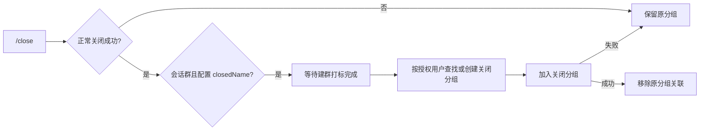
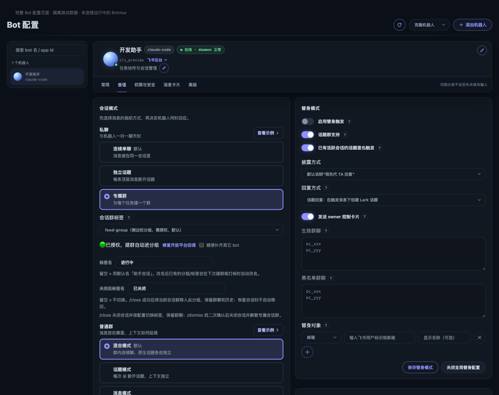

# 会话群关闭后切换消息分组

在专属会话群成功执行 `/close` 后，将该群加入配置的关闭分组，再移除原有自动分组关联。复用用户授权和现有标签服务，保留群聊与会话历史。配置留空时维持现状。



## 涉及功能与文件

- `src/services/feed-group-tagger.ts`：关闭分组切换与建群打标顺序。
- `src/services/session-groups-store.ts`：记录该群实际加入的自动分组 ID。
- `src/core/command-handler.ts`：只在 `/close` 正常关闭后调用（关闭卡按钮共用此路径）。
- `src/bot-registry.ts`、`src/core/dashboard-ipc-server.ts`、Dashboard 标签设置：新增 `sessionGroup.tag.closedName`，可保存/清空。
- 服务、IPC、命令路由和界面回归测试；中英文用户文档。

## 边界

- 仅 `feed-group`；不改变 `chat-tag`、`off`、普通群、话题、adopt、后台清理、崩溃或 `/stop`。
- 只处理建群对应用户、当前群和自动分组关系，不删除分组，不批量改其它群。
- 原分组与关闭分组 ID 相同则不移除；添加失败时不移除原关联。
- 标签失败不回滚关闭结果，单独告知；保持有界请求。
- 不自动回迁恢复会话、不增加定时扫描、不触发发布或替换正在运行的 daemon。

## 验收

- 正常关闭与配置热更新；配置为空/非法/清空；重复调用；新旧分组相同。
- 添加失败/部分失败、移除失败、缺授权、旧会话无分组记录。
- 建群异步打标完成后再迁移；关闭拒绝/残留/普通群不迁移。
- 相关 Vitest、TypeScript 和构建通过；记录尚未进行的真实飞书验证。

## 验证结果（2026-09-29）

- `npm exec --yes --package=bun@1.4.2 -- bun run build`：通过，包括 TypeScript、脚本/测试 mock 类型检查、Dashboard 构建和资源审计。
- 以下回归共 14 个文件、568 个测试通过：

```bash
./node_modules/.bin/vitest run --project unit \
  test/feed-group-close.test.ts \
  test/feed-group-tagger-default-name.test.ts \
  test/feed-group-tagger-self-heal.test.ts \
  test/session-groups-store.test.ts \
  test/command-handler.test.ts \
  test/ipc-session-group-tag-config-route.test.ts \
  test/dashboard-session-group-closed-tag.test.ts \
  test/dashboard-session-group-tag-repair.test.ts \
  test/dashboard-bot-defaults-refresh-race.test.ts \
  test/command-retry.test.ts \
  test/mention-mode-command.test.ts \
  test/session-group-birth-quota.test.ts \
  test/session-group-birth-workingdir.test.ts \
  test/session-group-birth-forward-seed.test.ts
```

- ego-lite：在隔离预览中加载实际 `SessionGroupTagRow`，验证关闭标签输入、失焦保存、刷新回显；后端为本地配置 fixture，未修改运行中 daemon 配置。
- 飞书移除关联接口已按 lark-cli schema/路由核对：`POST /open-apis/im/v1/groups/{feed_group_id}/batch_remove_item`。
- `git diff --check`：通过。
- 尚未进行真实飞书标签迁移、线上 `/close` 联调、Linux 实机验证；未部署或重启运行中的 daemon。共用关闭路径增加的是有条件的标签通知，不更改 CLI、PTY/tmux、远端后端的关闭实现；拒绝关闭和残留路径由回归测试覆盖。



## 后续调整：会话配置与 `/dismiss`

标签配置保留在现有「Bot 配置 → 会话 → 会话模式 → 私聊/专属群」内。此前截图仅为组件预览，本轮改用完整 Bot 配置页面验证和截图，补充关闭/解散语义提示，不新增独立页面。

新增 `/dismiss`：仅用于当前 Bot 创建的专属会话群，由建群用户且具备操作权限的真人发起。先返回绑定当前群、会话及运行状态的二次确认命令；确认后，先安全关闭会话，再调用现有飞书解散接口。发现其它活跃会话、未知状态、关闭拒绝或运行时残留时拒绝解散。解散失败保留群与登记，允许再次确认重试；成功后私聊通知发起人。不迁移关闭标签、不删除 worktree、不操作其它群。

涉及：命令注册及帮助、`core/dismiss-command.ts`、会话存储的严格群内活跃会话查询、现有群解散 API、配置提示及中英文说明、相关单测与完整页面预览。沿用当前 worktree；不部署、不实际解散群、不重新打开已关闭的 PR。


### 本轮验证

- 在上方 14 文件回归基础上，增加以下 15 文件，共 **29 文件、1025 测试通过**；1 条已有 Linux boot-id 条件用例在 macOS 未执行：

```bash
./node_modules/.bin/vitest run --project unit \
  test/dismiss-command.test.ts \
  test/groups-store-disband.test.ts \
  test/session-store.test.ts \
  test/dashboard-bot-defaults-layout.test.ts \
  test/command-trigger-reserved-commands.test.ts \
  test/command-trigger.test.ts \
  test/can-talk-daemon-commands.test.ts \
  test/command-trigger-store.test.ts \
  test/command-trigger-prompt-route.test.ts \
  test/bot-turn-mutation-gate.test.ts \
  test/close-consumer-matrix.test.ts \
  test/ipc-close-route.test.ts \
  test/riff-explicit-close.test.ts \
  test/mojo-explicit-close.test.ts \
  test/close-residual.test.ts
```

- `npm exec --yes --package=bun@1.4.2 -- bun run build`：TypeScript、脚本与 mock 类型检查、Dashboard 打包及资源审计均通过。
- ego-lite 加载完整 `BotDefaultsPage`，进入「会话」页签，输入关闭标签、失焦保存、刷新后回显；截图已替换为完整配置页面。HTTP 使用本机隔离 fixture，未访问运行中的 Dashboard。
- `/dismiss` 覆盖权限、二次确认、状态变化、重复确认、跨 Bot 活跃会话、异常存储、共享 adopt 两种入口、关闭拒绝/残留、群删除失败重试、私聊回执等路径；删除 API 必须明确返回成功码。
- 共用 CLI/后端关闭实现未改；当前 Bot 通过既有 admission gate 串行关闭/解散，跨 Bot 存储在关闭前后严格检查。未增加跨 daemon 分布式锁，不扩展到普通多人协作群。
- 未执行真实飞书解散或标签迁移，未做 Linux 实机验证，未部署或重启 daemon；原 PR 保持关闭。

- 实际入口回归先复现了“已关闭会话在命令分发前自动恢复”的问题，再针对 `/dismiss` 绕过同群自动恢复；无 mention 和带 mention 的确认命令均不恢复、不建幽灵会话，普通文本仍保留原恢复路径。
- 新的关闭消费者已纳入 `close-consumer-matrix`，拒绝与残留信息（含可识别的远端任务 ID）向用户传递，不会被扁平化成成功。

## 线上验证后修复：标签查询第一页参数

本机部署后的真实 `/close` 在分组查询阶段返回 HTTP 400、`9499`，错误原文为 `Missing required parameter: PageToken`。同一用户授权的只读对照请求补上 `page_token=` 后返回 HTTP 200、`code=0`，确认根因是请求漏参数；故障发生在分组添加、移除之前。

- `feed-group-tagger.ts`：第一页显式发送空 `page_token`，后续页沿用返回的游标；查询失败日志记录 HTTP 状态、API 错误码、具体原因及请求标识，不输出凭证。
- `feed-group-close.test.ts`：mock 按真实接口拒绝缺失参数；覆盖新旧会话、后续分页、查询失败不写入和错误日志。
- 影响面：共用标签查找路径（建群名称查找/自愈及关闭迁移）；不改变 CLI、关闭/解散、普通群或 `chat-tag` 行为。
- 验证顺序：先复现回归失败，再修复并运行标签相关回归、完整构建；按用户要求更新本机版本。不自动重试真实标签迁移，不执行解散，不重新打开旧 PR。

### 修复验证

- 修复前：真实参数约束下的 `feed-group-close.test.ts` 复现 10 项失败。
- 修复后：标签迁移/默认名称/自愈、Dashboard 标签与 owner、会话群存储共 6 文件 109 项通过；命令处理、关闭消费者、解散命令共 3 文件 426 项通过，合计 **9 文件 535 项通过**。
- `npm exec --yes --package=bun@1.4.2 -- bun run build` 通过（含 TypeScript、脚本与 mock 类型检查、Dashboard 打包及资源审计）；`git diff --check` 通过。
- 真实 API 仅验证过只读查询；完整标签迁移与真实解散仍未执行。

## 重新提交 PR：对齐最新 master

重新提交时同步 master 的跨进程 SQLite-only 会话库协议。解散群组前的跨 Bot 检查复用当前存储读取接口；仍有已知 Bot 未完成迁移、Bot 清单无法确认或活跃行损坏时，拒绝解散。测试保留迁移后旧行缺失 `larkAppId` 的归属检查，并增加未迁移/未知清单的拒绝路径；不恢复跨进程解析旧 JSON 的行为。

本机已运行分页修复提交 `dba1a20`，Bot 与 Dashboard 重启后在线；本次同步 master 的 PR 分支独立验证，不将其它上游改动自动部署到本机。PR 描述区分构建/回归、隔离界面预览与真实飞书写操作的验证边界。

- 最终合并态：上述 29 文件，加 `dashboard-feed-groups`、`dashboard-feed-group-owner.integration`、`session-store-sqlite`、`session-store-copy`、`known-bot-app-ids`、`mojo-isolation-inventory-failclosed`，共 **35 文件、1069 项通过，1 条已有 Linux boot-id 条件用例在 macOS 跳过**。
- 合并态完整构建通过，包括 TypeScript、脚本/mock 类型检查、Dashboard 打包和资源审计；`git diff --check` 通过。
- 测试先复现了新存储协议下漏检未迁移 Bot 的问题，再验证严格拒绝；SQLite 内损坏活跃行与旧行归属回归均通过。
